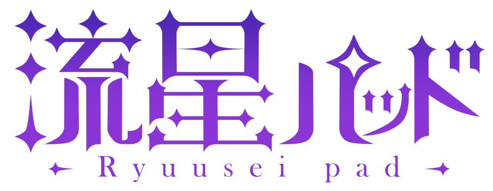
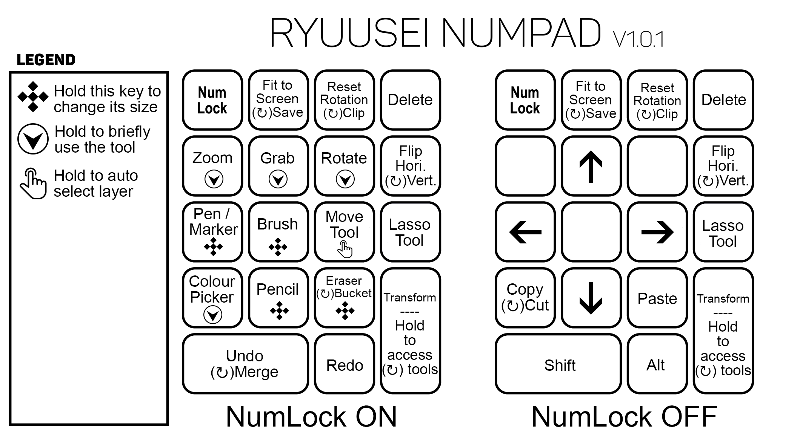

### Description 
Turns Numpad into Clip Studio Paint Hotkey
 
## Numpad Layout

## CSP Shortcut Settings

In general, I try to make it as close to the default shortcut settings as possible on CSP. However, there are few commands that are empty by default and you have to manually add/change it to utilize the Ryuusei's shortcut.

Shortcut Settings        | Shortcut Key | Reason 
-------------------------|:------------:|------------------
Reset Rotation/Inversion | **z**        | Empty by default
Pen                      | **;**        | **`P`** is being used by Pen and Brush
Flip Horizontal          | **f**        | Empty by default
Flip Vertical            | **v**        | Empty by default (soon to be removed)

 Modifier Key General Settings |  Tool  | Reason
:---------------------:|--------|--------
Ctrl | Object | Auto-select layer only works on paint tools (brush, pens, eraser, etc.) but not other tools (magnifier, grab, rotate). This is for consistency.
Ctrl + Space | Rotate | This is specifically a problem on my numpad model. By default the Rotate tool is Shift + Space. However, on my numpad model, the Shift turns the Numpad 9 into Page Up. Causing the shift key to get stuck.

# Future Work

Currently this is just my personal project. I only update it when I need it to be. However, most of the time, the current verison is working as fine as intended so the update is little to none. Sometime in the long future, I will try to move this into AutoHotKey v2.0 or to another programming language.